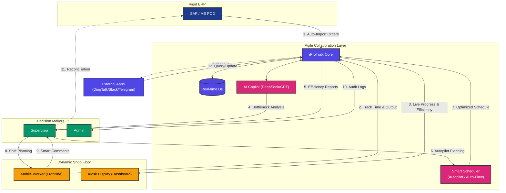
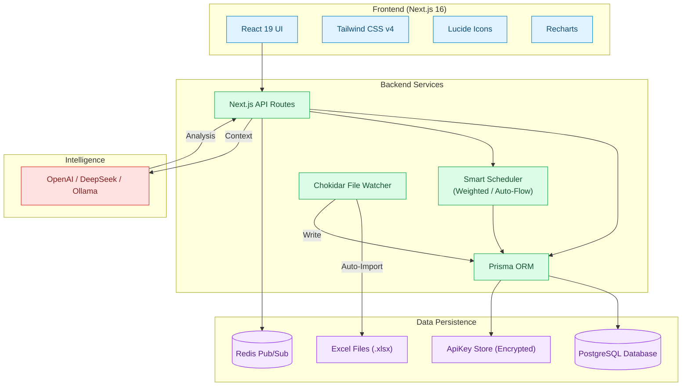

# iProTraX (formerly ProTracker)

## 🚀 Introduction
**iProTraX** is an AI-powered production tracking system that bridges the gap between rigid ERP systems and the dynamic shop floor.

[🇺🇸 English](README.md) | [🇨🇳 简体中文](README_ZH.md)

## 🎯 The Problem
In modern high-mix manufacturing, relying solely on heavy ERP systems like **SAP** or **ME POD** creates critical operational gaps:

1.  **System Rigidity**: SAP is powerful but inflexible. It cannot adapt quickly to the fluid reality of the shop floor (machine breakdowns, urgent re-prioritization).
2.  **Data Lag**: ME POD data often has a synchronization delay when importing to SAP. This means the "System Truth" (SAP) is often hours behind the "Ground Truth" (Shop Floor).
3.  **Invisible Steps**: Operational steps often get skipped or not recorded in SAP due to complexity, causing orders to appear "stuck" in the wrong status.
4.  **The "Black Box" Effect**: Planners and Supervisors cannot see real-time progress. They rely on:
    *   Manual spreadsheets (siloed data).
    *   Social media/chat apps for updates (unprofessional, hard to track).
    *   Human memory (prone to error).

**Result**: You cannot precisely schedule manpower or machines because you don't know the *actual* state of the floor.


iProTraX is not a replacement for SAP. It is the **Agile Collaboration Layer** that sits between your heavy ERP and your agile teams.

It provides a lightweight, real-time visual interface that:
*   **Visualizes the Invisible**: Tracks the micro-steps and real-time status that SAP misses.
*   **Empowers "Super Edit"**: Allows Supervisors to correct data instantly (e.g., bypassing a "stuck" step) without waiting for IT tickets.
*   **Kiosk Mode**: Replaces "asking via WhatsApp" with large, auto-updating shop floor monitors.
*   **AI-Driven Insights**: A built-in AI assistant that analyzes risk and generates reports, replacing manual data crunching.



---

## 🚀 Quick Start
### 1. Install Dependencies
```bash
npm install
```

### 2. Configure Environment Variables
Add your OpenAI API Key to the `.env` file:
```
OPENAI_API_KEY=sk-your-api-key-here
LICENSE_KEY=your-license-key-here  # Optional: Leave empty for Free Tier (1 Line, 10 Users)
```

### 3. Start Development Server
```bash
npm run dev
```
Visit http://localhost:3001

### 4. Default Credentials
After the initial deployment, use the following credentials to access the **SuperAdmin** account:

*   **Employee ID (UserID)**: `SUPER001`
*   **Default Password**: `superadmin123`

> [!IMPORTANT]
> For security, it is highly recommended to change this password immediately after your first login via the User Management settings.

---

## ✨ Key Capabilities

### 1. 🖥️ Shop Floor Kiosk (The "Control Tower")
*   **Purpose**: Replaces social media updates. A passive, always-on monitor for the floor.
*   **Features**:
    *   **Auto-Scroll & Refresh**: No mouse needed. Cycles through active orders.
    *   **Visual Priority**: Color-coded status (WIP, HOLD, QN) for instant awareness.
    *   **Privacy & Security**: Locked down mode with password-protected admin access.

### 2. ✏️ Super Edit Mode (Agile Correction)
*   **Purpose**: Fix "SAP Lag" and "Missing Steps" instantly.
*   **Features**:
    *   **Direct Manipulation**: Supervisors can "force" a step to complete or correction data directly in the UI.
    *   **Optimistic UI**: No waiting for server round-trips; changes feel instant.
    *   **Audit Trail**: Every change is logged, ensuring accountability while allowing flexibility.

### 3. 🤖 AI Copilot (The "Digital Planner")
*   **Purpose**: Augment human decision making.
*   **Features**:
    *   **Risk Analysis**: "Which orders are stuck in WIP for >24h?"
    *   **Context Aware**: Knows your specific product lines and terminology. Supports DeepSeek (China).
    *   **Smart Comments**: Tracks discussions per-step, allowing precise problem-solving directly in the flow.
    *   **Zero-Wait Auto-Flow**: Automatically schedules the next step immediately upon completion, minimizing idle time (Pull System).

### 4. ⏱️ Productivity Engine (Efficiency Loop)
*   **Purpose**: Quantify worker output and efficiency, eliminating guesswork.
*   **Features**:
    *   **Active Session Cards**: Integrated view for workers with **live timer**, **progress bar**, and **standard time (Std)** reference.
    *   **Compact Stop**: One-click quick stop with strict quantity validation/limits.
    *   **Standard Time Mgmt**: Admin configurable standard times (HH:MM) and target quantities per step.
    *   **Efficiency Analytics**: Supervisor-exclusive dashboard showing daily output heatmaps and efficiency rankings.

### 5. ⚡ Real-time Engine (Redis)
*   **Purpose**: Zero-latency collaboration.
*   **Features**:
    *   **Instant Sync**: Updates appear on all screens (Kiosk, Dashboard) effectively instantly (<50ms).
    *   **No Polling**: Replaced old "refresh every minute" mechanism with efficient Server-Sent Events.

### 6. 🔔 Real-time Notifications (Webhook)
*   **Purpose**: Keep stakeholders informed without checking the dashboard.
*   **Features**:
    *   **Multi-Channel**: Built-in support for **DingTalk, WeCom, Feishu, Slack, Telegram, Discord, Bark** and more.
    *   **Smart Triggers**: Alert Supervisors on **Hold/QN**, notify Planners on **Done**, and send **Daily Morning Reports**.
    *   **Dynamic Config**: Customize payloads, headers, and endpoints for any system integration.

### 7. 🔌 External REST API v1
*   **Purpose**: Securely integrate with other factory systems (MES, WMS, BI).
*   **Features**:
    *   **Management UI**: Create and revoke API keys with granular permissions (e.g., `orders:read`, `reports:read`).
    *   **Bearer Auth**: Standardized token-based authentication for secure machine-to-machine access.
    *   **Comprehensive Docs**: Built-in testing guide for rapid integration.

---

## 🛠️ Technology Stack



---

## 🔒 Security & Management
*   **Role-Based Access**: Strict separation between Admin, Supervisor, User, and Kiosk roles.
*   **Log Management**: Full CSV export capabilities for post-mortem analysis.

---

### Visual Experience

#### 1. The Gateway (Login)
Stunning dark-themed login portal with the new v8.0.0 branding featuring internationalization support.


#### 2. The Command Center (Dashboard)
Comprehensive production data grid with detailed management controls.


#### 3. The Control Tower (Kiosk Mode)
Optimized for large screens, this view aligns data perfectly for shop floor visibility.


#### 4. The AI Assistant (Production Copilot)
Real-time risk analysis and data insights powered by LLMs.


#### 5. The Frontline (Mobile Worker View)
Simplified, touch-friendly interface for operators on the floor.


---

### DEMO
### DEMO
*   **Live App**: https://protracker.puppy101.dpdns.org/
*   **Showcase & Docs**: https://iprotrax.work
Contact author for access: contact@iprotrax.work

---

## 📝 Changelog highlights
*   **v8.2.0**: **Smart Scheduler 2.0** - "Zero-Wait" Auto-Flow feature, Simplified priority logic (Red Bonus/+1000) and optimized default weights (50/50). **Dashboard** - Enhanced sorting (Red > Yellow > Date). **Operation UI** - Improved target quantity display in header. Batch Edit stability fixes.
*   **v8.1.0**: **Security Upgrade** - Implementing ES256 hardware-backed signing (YubiKey) for licenses. **Free Tier** - Now supports permanent free use for small teams (1 Line, 10 Users). Productivity Engine - "Active Sessions" card, Real-time Efficiency, Quick Stop.
*   **v8.0.0**: Enterprise Edition - Full internationalization (English/Chinese), enhanced security (session encryption), comprehensive testing framework (Vitest/Playwright), performance optimizations, and improved Docker deployment automation.
*   **v7.0.0**: Smart Comments (Order-level Collaboration), Configurable AI Visibility, Enhanced AI Privacy (Strict ID mode), Supervisor Excel Import, and Multi-tier Employee Cooperation.
*   **v6.5.0**: Docker Production Support (Node 22, Fixed Watcher, CVE Remediation).
*   **v6.4.0**: Added Order Deletion & Kiosk Alignment fixes.
*   **v6.3.0**: Introduced Super Edit Mode.
*   **v6.1.0**: Launched Professional Kiosk Mode.

---

## 🛡️ License & Community
[](https://www.gnu.org/licenses/agpl-3.0)
[](https://github.com/Tropical8818/iProTraX)

## 📈 Git Trend
[](https://star-history.com/#Tropical8818/iProTraX&Date)
