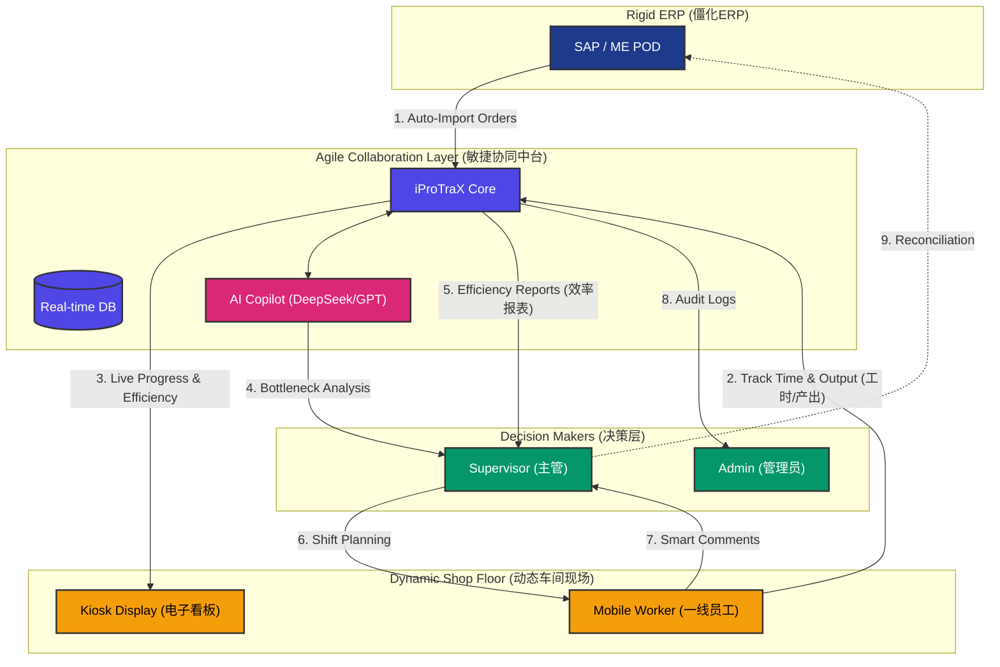
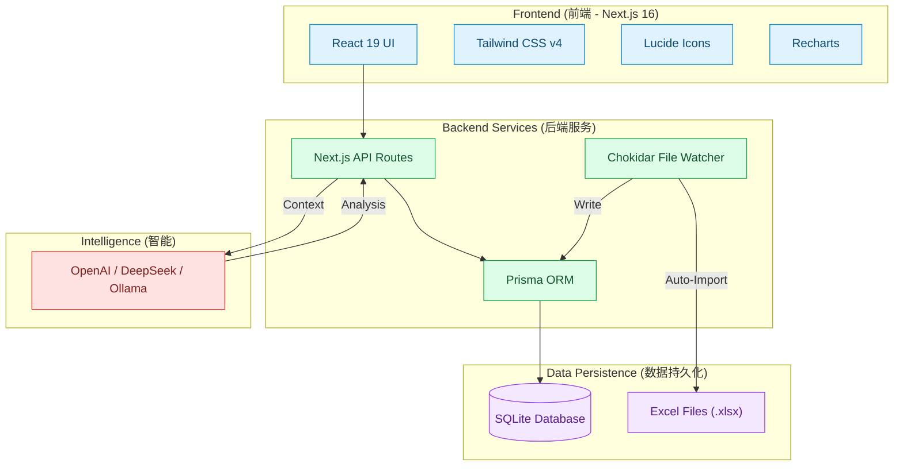

# iProTraX - 敏捷制造协同平台 (Agile Manufacturing Collaboration Platform)
> 连接僵化 ERP 与动态车间的敏捷协同层。

[🇺🇸 English](README.md) | [🇨🇳 简体中文](README_ZH.md)

## 🎯 痛点：被忽视的生产"黑盒"
在现代多品种、小批量的即时制造环境中，仅仅依赖 **SAP** 或 **ME POD** 等重型 ERP 系统会产生严重的运营断层：

1.  **系统僵化 (System Rigidity)**：SAP 强大但不够灵活，很难迅速适应车间的动态变化（如机器故障、紧急插单）。
2.  **数据滞后 (Data Lag)**：从 ME POD 导入数据到 SAP 往往存在时间差。这意味着系统中的"即时库存"（System Truth）往往比"车间实况"（Ground Truth）滞后数小时。
3.  **隐形步骤 (Invisible Steps)**：由于流程复杂，很多微小的操作步骤被略过或未记录，导致工单在 SAP 中显示为"卡住"或状态错误。
4.  **"黑盒"效应 (The Black Box)**：计划员和主管无法看到实时的生产进度。他们被迫依赖：
    *   手工 Excel 表格（数据孤岛）。
    *   微信/WhatsApp 聊天汇报（不专业、难以追踪）。
    *   人的记忆（容易出错）。

**结果**：因为不知道车间的*真实*状态，你根本无法精确地调度人员或设备。


## 💡 解决方案：iProTraX
iProTraX 不是要取代 SAP。它是连接重型 ERP 与敏捷团队之间的 **敏捷协同层 (Agile Collaboration Layer)**。

它提供了一个轻量级、实时的可视化界面：
*   **可视化隐形数据**：追踪 SAP 遗漏的微小步骤和实时状态。
*   **赋能"超级编辑"**：允许主管即时修正数据（例如：强制完成一个卡住的步骤），无需等待 IT 开票。
*   **电子看板 (Kiosk)**：用大屏幕、自动刷新的车间显示器取代"WhatsApp询问"。
*   **AI 驱动洞察**：内置 AI 助手分析风险并生成日报，取代人工数据整理。



---

## 🚀 快速开始
### 1. 安装依赖
```bash
npm install
```

### 2. 配置环境变量
在 `.env` 文件中添加你的 OpenAI API Key:
```
OPENAI_API_KEY=sk-your-api-key-here
```

### 3. 启动开发服务器
```bash
npm run dev
```
访问 http://localhost:3001

### 4. 默认凭据 (Default Credentials)
首次部署后，使用以下凭据登录 **SuperAdmin** 账户：

*   **员工 ID (UserID)**: `SUPER001`
*   **默认密码**: `superadmin123`

> [!IMPORTANT]
> 为确保安全，强烈建议您在首次登录后立即通过"用户管理"设置更改此密码。

---

## ✨ 核心能力

### 1. 🖥️ 车间电子看板 (Shop Floor Kiosk) —— "控制塔"
*   **目标**：替代社交软件汇报。为车间提供一个被动式、常驻的监控屏幕。
*   **特性**：
    *   **自动滚动与刷新**：无需鼠标操作，自动循环显示活跃工单。
    *   **可视化优先级**：WIP（进行中）、HOLD（暂停）、QN（质量问题）颜色编码，一目了然。
    *   **隐私与安全**：专用的锁定模式，仅允许密码保护的管理员访问。

### 2. ✏️ 超级编辑模式 (Super Edit) —— "敏捷修正"
*   **目标**：即时修复 "SAP 滞后" 和 "步骤遗漏" 问题。
*   **特性**：
    *   **直接操作**：主管可以直接在 UI 上"强制"完成一个步骤或修正工单信息。
    *   **乐观 UI 响应**：无需等待服务器往返，操作感觉即时生效。
    *   **审计追踪**：每一次修改都有日志记录，既保证了灵活性，又确保了责任可追溯。

### 3. 🤖 AI 副驾驶 (AI Copilot) —— "数字计划员"
*   **目标**：增强人类的决策能力。
*   **特性**：
    *   **风险分析**："哪些工单在 WIP 状态停留超过 24 小时？"
    *   **上下文感知**：了解你特定的产品线术语和规则。支持 DeepSeek (中国) 模型。
    *   **智能评论**：按步骤追踪讨论，允许在生产流程中直接进行精准的问题解决。

### 4. ⏱️ 生产力引擎 (Productivity Engine) —— "效率闭环"
*   **目标**：量化追踪员工产出与效率，告别"凭感觉"管理。
*   **特性**：
    *   **我的进行中工单 (Active Sessions)**：在操作视图顶部以卡片形式展示当前任务，集成**实时计时器**、**进度条**和**标准工时 (Std)** 参考。
    *   **快速停止 (Compact Stop)**：一键结束任务并严格校验产出数量，防止超量输入。
    *   **标准工时管理**：管理员可为每个工序设定标准工时（HH:MM）和目标数量。
    *   **效率报表 (Analytics)**：主管专属的生产力仪表盘，通过热力图和排名表直观展示当日产出与效率。

---

## 🛠️ 技术栈 (Technology Stack)



---

## 🔒 安全与管理
*   **基于角色的访问控制 (RBAC)**：严格区分管理员、主管、用户和看板角色。
*   **日志管理**：支持 CSV 全量导出，便于事后分析和存档。

---

### 📸 视觉体验

#### 1. 入口 (Login)
令人惊艳的深色主题登录界面，采用全新的 v8.0.0 品牌标识，支持国际化。


#### 2. 指挥中心 (Dashboard)
全面的生产数据网格，具有详细的管理控制功能。


#### 3. 控制塔 (Kiosk Mode)
专为大屏幕优化，此视图完美展示车间所需的数据可见性。


#### 4. AI 智能助手 (Production Copilot)
基于大语言模型的实时风险分析与数据洞察。


#### 5. 一线作业 (Mobile Worker View)
专为车间操作员设计的简化触控界面。


---

### 演示 (DEMO)
https://iprotrax.work
联系作者获取访问权限: contact@iprotrax.work

---

## 📝 更新日志摘要
*   **v8.1.0**: **安全升级** - 实施 ES256 硬件签名 (YubiKey) 许可证验证。**免费版 (Free Tier)** - 支持小团队永久免费使用（1 条产线，10 个用户）。生产力引擎：新增"进行中工单"卡片、实时效率计算、快速停止功能。
*   **v8.0.0**: 企业版 - 完整国际化支持（中英文）、增强安全性（Session加密）、全面测试框架（Vitest/Playwright）、性能优化、改进的Docker自动部署。
*   **v7.0.0**: 工单级智能评论与多层级员工协作能力，可配置 AI 可见性，增强 AI 隐私（严格 ID 模式），主管 Excel 导入权限。
*   **v6.5.0**: Docker 生产环境就绪 (Node 22, Watcher 修复, CVE 修复).
*   **v6.4.0**: 新增工单删除功能 & 看板对齐修复。
*   **v6.3.0**: 引入超级编辑模式 (Super Edit)。
*   **v6.1.0**: 发布专业电子看板模式 (Kiosk Mode)。

---

## 🛡️ 许可与社区
[](https://www.gnu.org/licenses/agpl-3.0)
[](https://github.com/Tropical8818/iProTraX)

## 🚀 简介
**iProTraX** 是一个基于 AI 的生产追踪系统，旨在通过实时数据洞察、智能自动化和直观的用户界面，彻底改变传统车间管理。它将生产流程数字化，提升效率，减少人为错误，并为决策者提供前所未有的可见性。

## 📈 Git 趋势 (Git Trend)
[](https://star-history.com/#Tropical8818/iProTraX&Date)
