# iProTraX - 敏捷制造协同平台 (Agile Manufacturing Collaboration Platform)
> 连接僵化 ERP 与动态车间的敏捷协同层。

[🇺🇸 English](README.md) | [🇨🇳 简体中文](README_ZH.md)

## 🎯 痛点：被忽视的生产"黑盒"
在现代多品种、小批量的即时制造环境中，仅仅依赖 **SAP** 或 **ME POD** 等重型 ERP 系统会产生严重的运营断层：

1.  **系统僵化 (System Rigidity)**：SAP 强大但不够灵活，很难迅速适应车间的动态变化（如机器故障、紧急插单）。
2.  **数据滞后 (Data Lag)**：从 ME POD 导入数据到 SAP 往往存在时间差。这意味着系统中的"即时库存"（System Truth）往往比"车间实况"（Ground Truth）滞后数小时。
3.  **隐形步骤 (Invisible Steps)**：由于流程复杂，很多微小的操作步骤被略过或未记录，导致工单在 SAP 中显示为"卡住"或状态错误。
4.  **"黑盒"效应 (The Black Box)**：计划员和主管无法看到实时的生产进度。他们被迫依赖：
    *   手工 Excel 表格（数据孤岛）。
    *   微信/WhatsApp 聊天汇报（不专业、难以追踪）。
    *   人的记忆（容易出错）。

**结果**：因为不知道车间的*真实*状态，你根本无法精确地调度人员或设备。

---

## 🔐 默认凭据 (Default Credentials)
首次部署后，使用以下凭据登录 **SuperAdmin** 账户：

*   **员工 ID (UserID)**: `SUPER001`
*   **默认密码**: `superuser2025`

> [!IMPORTANT]
> 为确保安全，强烈建议您在首次登录后立即通过"用户管理"设置更改此密码。

---

## 💡 解决方案：iProTraX
iProTraX 不是要取代 SAP。它是连接重型 ERP 与敏捷团队之间的 **敏捷协同层 (Agile Collaboration Layer)**。

它提供了一个轻量级、实时的可视化界面：
*   **可视化隐形数据**：追踪 SAP 遗漏的微小步骤和实时状态。
*   **赋能"超级编辑"**：允许主管即时修正数据（例如：强制完成一个卡住的步骤），无需等待 IT 开票。
*   **电子看板 (Kiosk)**：用大屏幕、自动刷新的车间显示器取代"微信询问"。
*   **AI 驱动洞察**：内置 AI 助手分析风险并生成日报，取代人工数据整理。

```mermaid
flowchart TB
 subgraph RigidERP["Rigid ERP (僵化ERP)"]
        SAP["SAP / ME POD"]
  end
 subgraph DynamicShop["Dynamic Shop (动态车间)"]
        Tech["Technician / Digital Updates (技术员/数字化更新)"]
        Kiosk["Kiosk Mode (电子看板)"]
  end
 subgraph AgileCollaboration["Agile Collaboration (敏捷协同)"]
        Core["iProTraX Core"]
        DB[("Local Database")]
        AI["AI Copilot"]
  end
 subgraph Management["Management (管理层)"]
        Supervisor["Supervisor / Super Edit (主管/超级编辑)"]
        Admin["Admin / System Control (管理员/系统控制)"]
  end
    SAP -- "1. Auto-Import (Excel)" --> Core
    Core -- "2. Real-time Status" --> Kiosk
    Tech -- "3. Digital Updates" --> Core
    Core -- Store --> DB
    Core <--> AI
    AI -- Risk Analysis --> Supervisor
    Core -- "4. Monitoring & Correction" --> Supervisor
    Core -- "5. CSV Export & Logs (CSV导出/日志)" --> Admin
    Admin -- "7. Manage Lines & Users (产线管理 & 用户控制)" --> Core
    Admin -. "8. Control AI Context (AI能力控制)" .-> AI
    Supervisor -. "6. Reconciliation" .-> SAP
    Tech <-- "Step Collaboration (工步级协同)" --> Supervisor
    SAP ~~~ Tech & Core
    Tech ~~~ Supervisor & Core
    Core ~~~ Admin

     SAP:::sap
     Tech:::shop
     Kiosk:::kiosk
     Core:::core
     DB:::db
     Supervisor:::super
     Admin:::admin
    classDef sap fill:#1e3a8a,stroke:#333,stroke-width:2px,color:white
    classDef core fill:#4f46e5,stroke:#333,stroke-width:2px,color:white
    classDef kiosk fill:#059669,stroke:#333,stroke-width:2px,color:white
    classDef super fill:#d97706,stroke:#333,stroke-width:2px,color:white
    classDef admin fill:#b45309,stroke:#333,stroke-width:2px,color:white
    classDef db fill:#fff,stroke:#333,stroke-width:2px
    classDef shop fill:#f59e0b,stroke:#333,stroke-width:2px,color:black
```



---

## 🚀 快速开始
### 1. 安装依赖
```bash
npm install
```

### 2. 配置环境变量
在 `.env` 文件中添加你的 OpenAI API Key:
```
OPENAI_API_KEY=sk-your-api-key-here
```

### 3. 启动开发服务器
```bash
npm run dev
```
访问 http://localhost:3001

---

## ✨ 核心能力

### 1. 🖥️ 车间电子看板 (Shop Floor Kiosk) —— "控制塔"
*   **目标**：替代社交软件汇报。为车间提供一个被动式、常驻的监控屏幕。
*   **特性**：
    *   **自动滚动与刷新**：无需鼠标操作，自动循环显示活跃工单。
    *   **可视化优先级**：WIP（进行中）、HOLD（暂停）、QN（质量问题）颜色编码，一目了然。
    *   **隐私与安全**：专用的锁定模式，仅允许密码保护的管理员访问。
    *   **表格对齐优化**：专为远距离阅读设计的等宽数字对齐。

### 2. ✏️ 超级编辑模式 (Super Edit) —— "敏捷修正"
*   **目标**：即时修复 "SAP 滞后" 和 "步骤遗漏" 问题。
*   **特性**：
    *   **直接操作**：主管可以直接在 UI 上"强制"完成一个步骤或修正工单信息。
    *   **乐观 UI 响应**：无需等待服务器往返，操作感觉即时生效。
    *   **审计追踪**：每一次修改都有日志记录，既保证了灵活性，又确保了责任可追溯。

### 3. 🤖 AI 副驾驶 (AI Copilot) —— "数字计划员"
*   **目标**：增强人类的决策能力。
*   **特性**：
    *   **风险分析**："哪些工单在 WIP 状态停留超过 24 小时？"
    *   **报告生成**："根据今天的日志起草一份交接班报告。"
    *   **上下文感知**：了解你特定的产品线术语和规则。
    *   **类别分析**：分析针对特定类别的评论（如 QN、设备、物料），识别瓶颈。
    *   **智能评论**：按步骤追踪讨论，允许在生产流程中直接进行精准的问题解决。

    *   **智能评论**：按步骤追踪讨论，允许在生产流程中直接进行精准的问题解决。

---

## 🛠️ 技术栈 (Technology Stack)

```mermaid
flowchart TB
    subgraph Client ["Frontend (前端 - Next.js 16)"]
        UI[React 19 UI]
        TW[Tailwind CSS v4]
        Icon[Lucide Icons]
        Chart[Recharts]
    end

    subgraph Server ["Backend Services (后端服务)"]
        API[Next.js API Routes]
        Watcher[Chokidar File Watcher]
        Prisma[Prisma ORM]
    end

    subgraph Data ["Data Persistence (数据持久化)"]
        SQLite[(SQLite Database)]
        Excel[Excel Files (.xlsx)]
    end

    subgraph AI ["Intelligence (智能)"]
        OpenAI[OpenAI / DeepSeek]
    end

    %% Connections
    UI --> API
    API --> Prisma
    Prisma --> SQLite
    Watcher -->|Auto-Import| Excel
    Watcher -->|Write| Prisma
    API -->|Context| OpenAI
    OpenAI -->|Analysis| API

    %% Styling
    classDef fe fill:#e0f2fe,stroke:#0284c7,color:#0c4a6e;
    classDef be fill:#dcfce7,stroke:#16a34a,color:#14532d;
    classDef db fill:#f3e8ff,stroke:#9333ea,color:#581c87;
    classDef ai fill:#fee2e2,stroke:#dc2626,color:#7f1d1d;

    class UI,TW,Icon,Chart fe;
    class API,Watcher,Prisma be;
    class SQLite,Excel db;
    class OpenAI ai;
```

---

## 🔒 安全与管理
*   **基于角色的访问控制 (RBAC)**：严格区分管理员、主管、用户和看板角色。
*   **日志管理**：支持 CSV 全量导出，便于事后分析和存档。

---

### 📸 视觉体验

#### 1. 入口 (Login)
令人惊艳的深色主题登录界面，采用全新的 v7.0.0 品牌标识。


#### 2. 指挥中心 (Dashboard)
全面的生产数据网格，具有详细的管理控制功能。


#### 3. 控制塔 (Kiosk Mode)
专为大屏幕优化，此视图完美展示车间所需的数据可见性。


#### 4. AI 智能助手 (Production Copilot)
基于大语言模型的实时风险分析与数据洞察。


#### 5. 一线作业 (Mobile Worker View)
专为车间操作员设计的简化触控界面。


---

### 演示 (DEMO)
https://iprotrax.work
联系作者获取访问权限: contact@iprotrax.work

---

## 📝 更新日志摘要
*   **v7.0.0**: 工单级智能评论与多层级员工协作能力，可配置 AI 可见性，增强 AI 隐私（严格 ID 模式），主管 Excel 导入权限。
*   **v6.5.0**: Docker 生产环境就绪 (Node 22, Watcher 修复, CVE 修复).
*   **v6.4.0**: 新增工单删除功能 & 看板对齐修复。
*   **v6.3.0**: 引入超级编辑模式 (Super Edit)。
*   **v6.1.0**: 发布专业电子看板模式 (Kiosk Mode)。

---

## 🛡️ 许可与社区
[](https://opensource.org/licenses/MIT)
[](https://github.com/Tropical8818/ProTracker)

## 📈 Git 趋势 (Git Trend)
[](https://star-history.com/#Tropical8818/ProTracker&Date)
